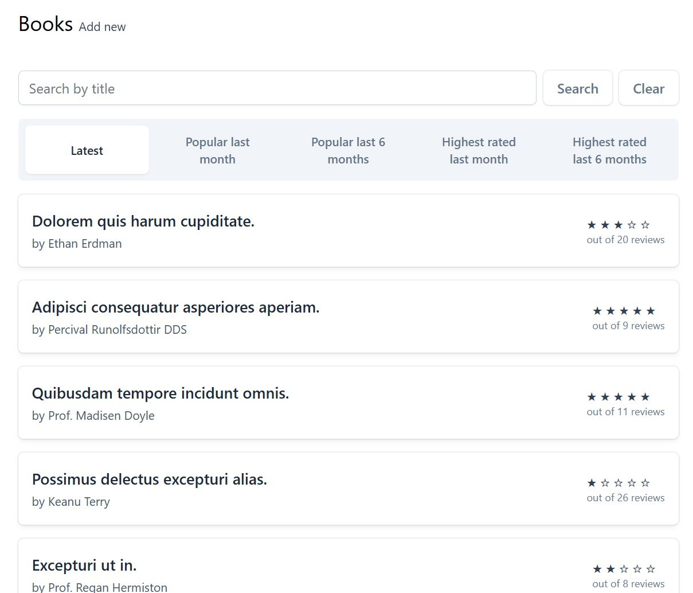
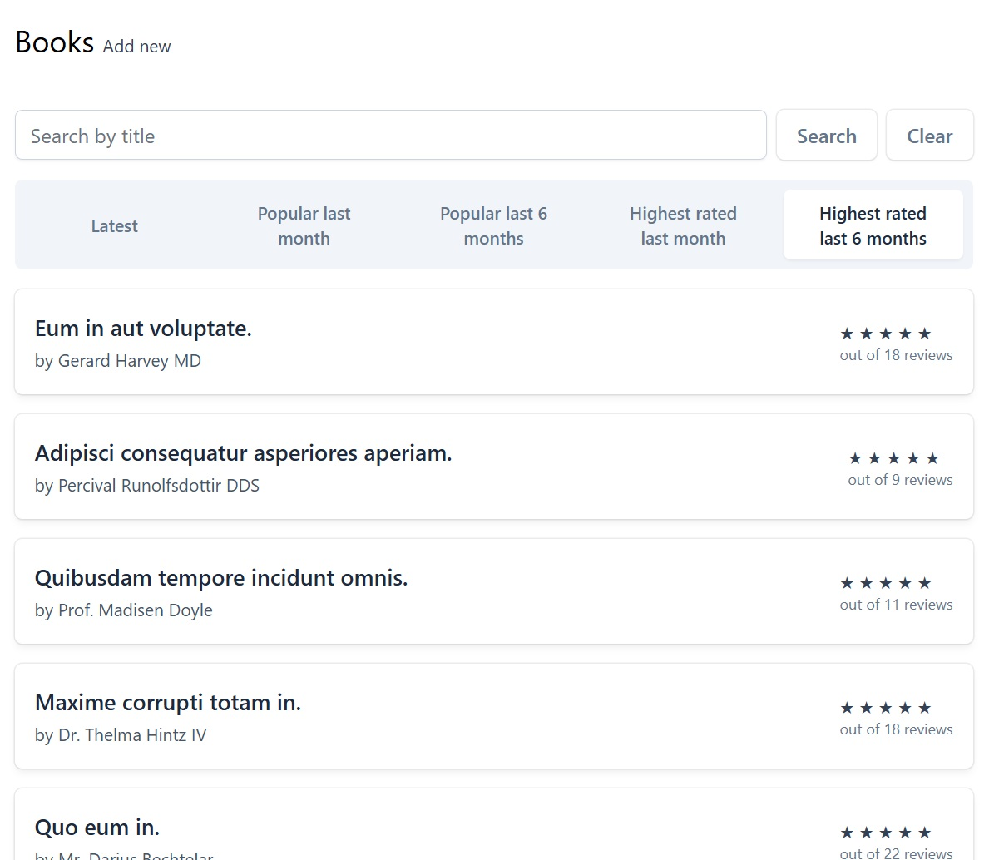
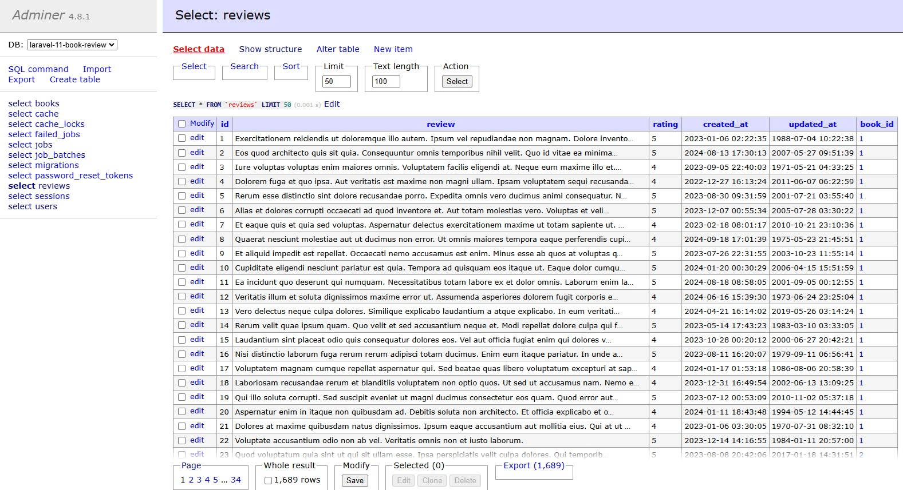
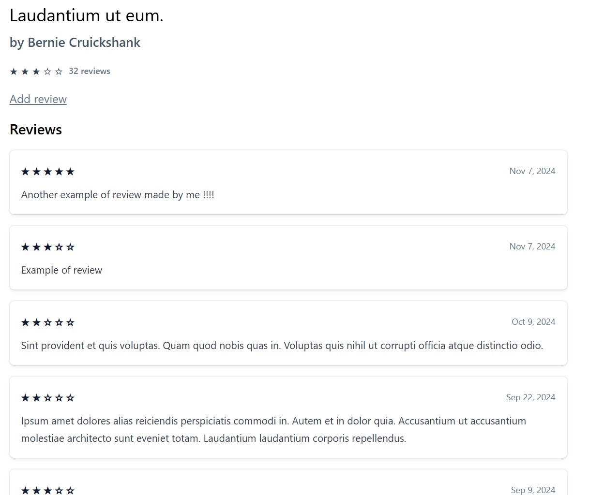
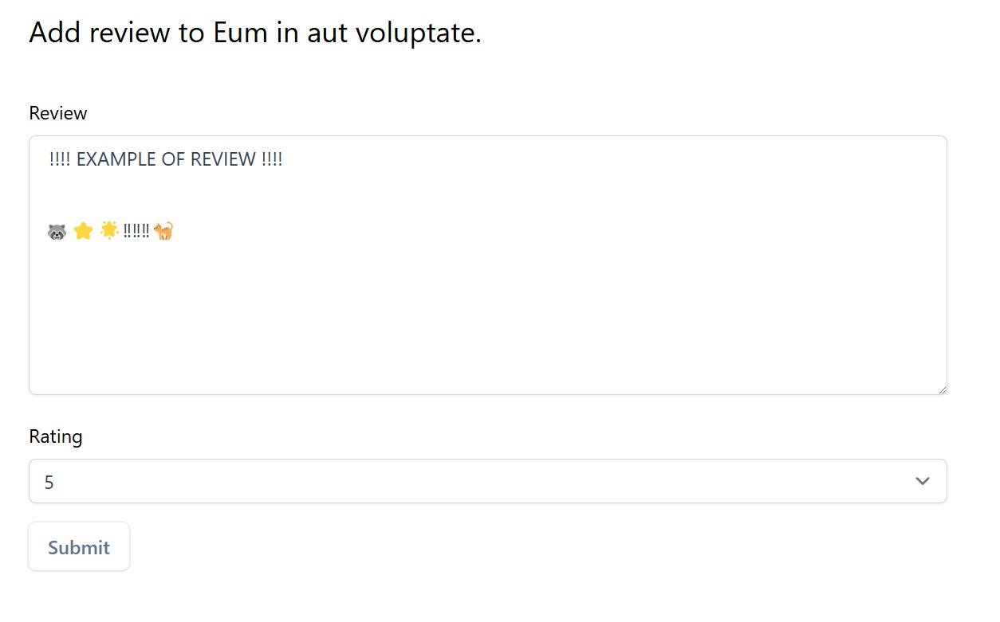

# Pablo Paez 🦝 - LARAVEL - TASK LIST 💻

 

  

# El Proyecto⭐ / The Project🌟

  

⭐ El proyecto es parte del portfolio de proyectos de LARAVEL, en esto caso una aplicacion de reviews sobre libros al estilo Letterboxd donde los usuarios pueden buscar los libros mas populares entre "x" cantidades de tiempo o por ejemplo los ultimos libros publicados y posteriormente pueden calificarlos desde 1 a 5 estrellas ⭐ y escribirles una reseña.
El proyecto es parte del portfolio de proyectos de LARAVEL, en esto caso una aplicacion de Tast Lists donde se llevara un registro de las actividades por hacer, las ya hechas, y creacion y eliminacion de las mismas
 
🌟 This project is part of the LARAVEL project portfolio. It is a book review application similar to Letterboxd, where users can search for the most popular books within a specific timeframe, such as the latest releases. Subsequently, they can rate these books on a 5-star scale ⭐ and write reviews

### Tecnologias utilizadas: / Technologies used:

PHP - LARAVEL - TAILWIND / SQL - DOCKER DESKTOP

Tambien se usaron conocimientos en: / Furthermore, expertise in this technologies was utilized: 

    -TAILWIND
    -CUSTOM BLADE COMPONENTS
    -USER SESIONS
    -DATABASE INTERACTIONS WITH ELOQUENT ORM
    -CRUD OPERATIONS
    -FORM VALIDATING
    -SESSION HANDLING
    -Relationships in Eloquent
    -Rate Limiting
    -Catching for performance optimization

<!-- LINKS -->
### Contacto📩 / Contact📩

Pablo Paez - Desarrollador Web - pablopaez2307@gmail.com

[![LinkedIn][linkedin-shield]][linkedin-url]

[linkedin-shield]: https://img.shields.io/badge/-LinkedIn-black.svg?style=for-the-badge&logo=linkedin&colorB=555
[linkedin-url]: https://www.linkedin.com/in/pablo-paez-t/
